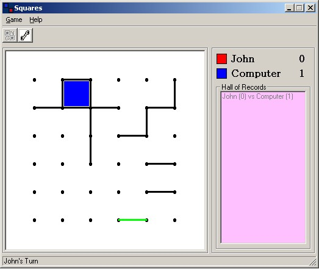



## Squares 1\.0

### Description

Squares is a game where two players take turns connecting any two adjacent dots in a grid, either horizontally or vertically. The object is to be the player to complete a square and gain a point and another turn. The winner is the player with the most points. Three modes of play are supported: vs the computer, vs a friend on the same PC sharing the mouse and vs a friend over the Internet.
 
### More Info
 

             |
---                |---
**Submitted On**   |2002-02-08 20:38:40
**By**             |[Tyson Ackland](https://github.com/Planet-Source-Code/PSCIndex/blob/master/ByAuthor/tyson-ackland.md)
**Level**          |Advanced
**User Rating**    |5.0 (50 globes from 10 users)
**Compatibility**  |VB 6\.0
**Category**       |[Games](https://github.com/Planet-Source-Code/PSCIndex/blob/master/ByCategory/games__1-38.md)
**World**          |[Visual Basic](https://github.com/Planet-Source-Code/PSCIndex/blob/master/ByWorld/visual-basic.md)
**Archive File**   |[Squares\_1\_551882142002\_0\.zip](https://github.com/Planet-Source-Code/tyson-ackland-squares-1-0__1-31780/archive/master.zip)

